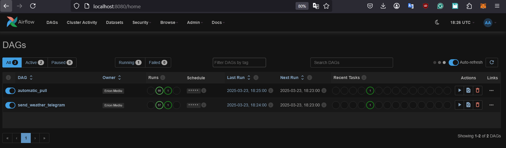
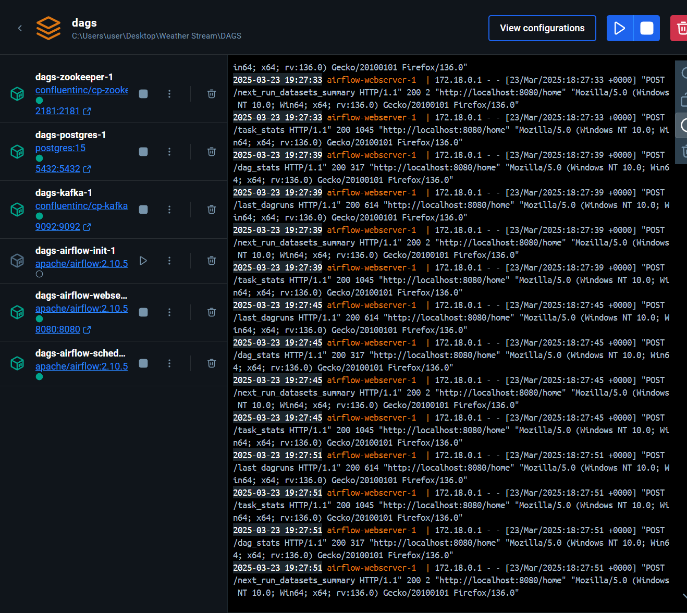
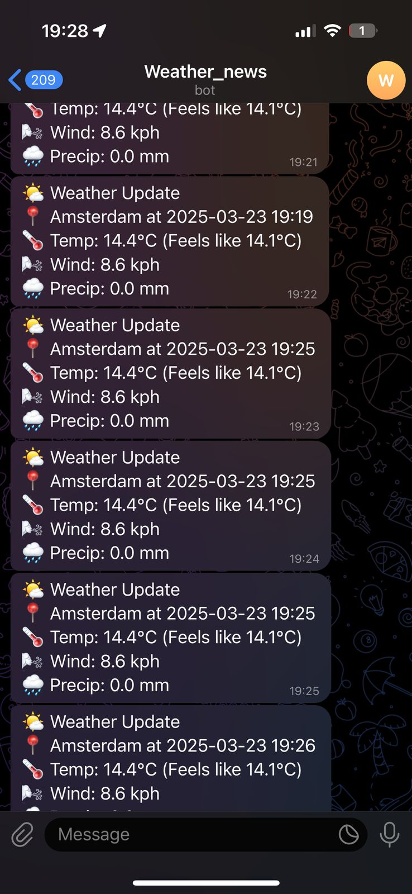

# 🌤️ Real-Time Weather Stream to Telegram using Airflow + Kafka

This project streams weather data every 15 minutes via Kafka and sends updates to a Telegram chat using Apache Airflow.

---

## 🔧 Setup Instructions (Local)

### 1. Clone the repository

    - git clone https://github.com/erionmediu/Weather---streamer
    - cd weather-stream


### 2. Create a virtual environment (for running Kafka producer/test)
    - python -m venv venv
    - source venv/bin/activate  <>  For Windowse: .\venv\Scripts\activate  on Windows
    - pip install -r requirements.txt

### 3. Expected Folder Structure pre build
    weather-stream/
    ├── dags/
    │   ├── weather_dag.py
    │   └── telegram_weather.py
    ├── docker-compose.yml
    ├── requirements.txt
    └── README.md

### 5. 💬 Telegram Setup

    - Create a bot via BotFather

    - Copy the token and update it in telegram_weather.py

    - Send a message to the bot from your Telegram account

    - Get your chat ID by calling:
        - https://api.telegram.org/bot<your_token>/getUpdates

### 6. Weather API set up

    - Get a free api at https://www.weatherapi.com/
    - Update "mykey" at weather_dag.py


### 6. Start the entire stack
    - docker compose up --build


### 7. Access the Airflow UI

    - Open browser: http://localhost:8080

    - Login: admin / admin


#### Airflow UI :



#### Docker logs :



#### Telegram bot posting reponse :




```bash


